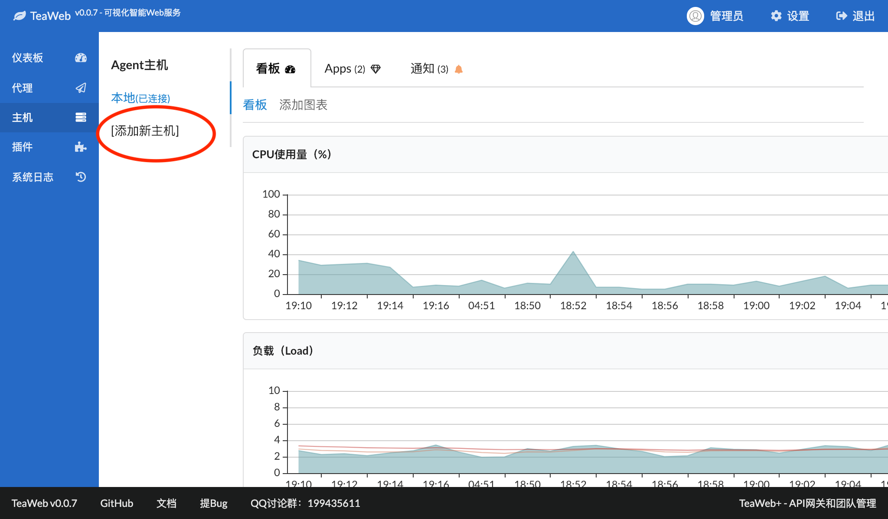
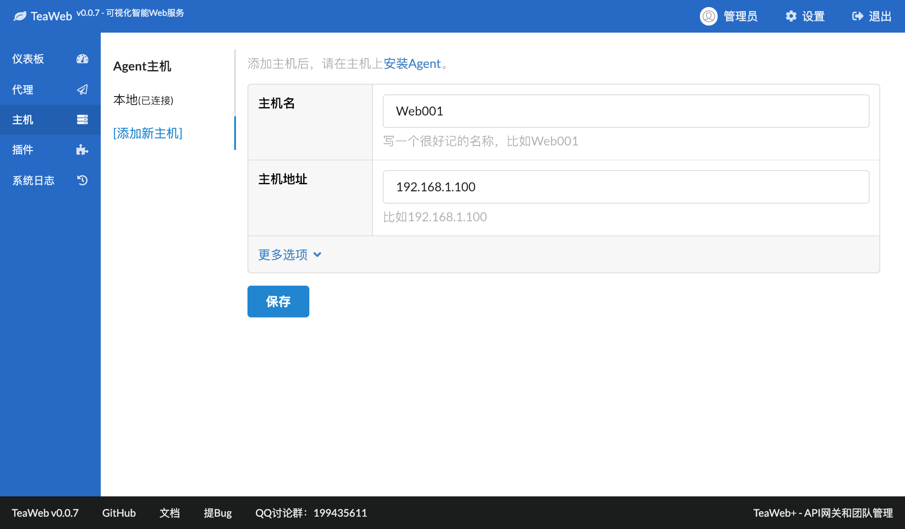
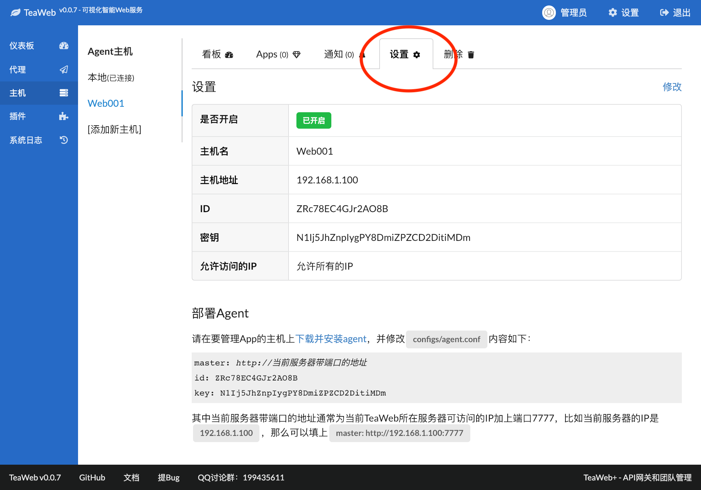

# 通过ID和Key安装Agent

## 步骤1：添加一个Agent主机
点击下图中的"添加新主机"：

在出现的表单中填入主机名和主机地址，这两项都没有严格的要求，只要能表明主机的用途和主机的地址就好：

点击上图中的"保存"，即可保存成功。

## 步骤2：查看部署的配置
点击刚添加的主机对应的"设置"按钮，会出现以下界面：

可以在这个界面上看到主机的ID（`id`）和密钥（`key`）。

## 步骤3：下载并部署Agent
在 [http://teaos.cn/download](http://teaos.cn/download) 下载对应平台的Agent版本，解压后用编辑器打开`configs/agent.conf`，然后修改里面的内容：
* `master` - 可以访问到Master的地址，需要带有`http://`或者`https://`；如果有必要，需要设置`iptables`或`firewall`；
* `id` - 将此值修改为步骤2看到的ID；
* `key` - 将此值修改为步骤2看到的密钥。

**Windows用户注意** 如果你是用Windows上的记事本打开的配置文件，可能会遇到换行符不见而导致无法解析配置的问题，所以建议用别的编辑器打开。

### 测试
使用以下脚本测试连接：
~~~bash
bin/teaweb-agent test
~~~

### 启动
如果测试后同Master的连接没有错误，则可以启动Agent：
~~~bash
bin/teaweb-agent start
~~~

启动后，可以在`logs/run.log`中看运行的日志。

## 更多命令
除了测试和启动命令外，还提供了以下几个命令：
~~~bash
# 查看帮助
bin/teaweb-agent help

# 测试和主服务器连接
bin/teaweb-agent test

# 在前端运行，阻塞当前命令窗口
bin/teaweb-agent 

# 启动
bin/teaweb-agent start

# 停止
bin/teaweb-agent stop

# 重启
bin/teaweb-agent restart 

# 手动执行任务，123456是任务ID示例
bin/teaweb-agent run 123456

# 手动执行监控项数据源，123456是监控项ID示例
bin/teaweb-agent run 123456

# 查看Agent版本（从v0.1.1开始支持）：
bin/teaweb-agent version
~~~

## Windows系统
在Windows系统上，需要将相关命令改成：
~~~bash
bin\teaweb-agent.exe xxx
~~~

## 开机启动
可以使用服务的方式设置Agent随开机启动。

从v0.1.6开始，在Windows下可以运行`bin\`目录下的`service-install.exe`和`service-uninstall.exe`两个命令，分别是安装服务和卸载服务；如果后期Agent安装目录改变了，需要先卸载服务再重新安装，以便服务能找到正确的Agent安装目录。如果提示权限错误，以管理员身份运行这两个命令（通常在鼠标右键有"以管理员身份运行"）。如果提示`A system shutdown is in process`，则试着转到`bin\`目录下重新运行命令尝试。

在Linux下可以运行`bin/`下的`service-install`和`service-uninstall`两个命令，分别是安装服务和卸载服务；如果后期Agent安装目录改变了，可以重新运行服务安装命令，以便服务能找到正确的TeaWeb目录。

## 常见错误
### invalid response
类似于：
~~~
start failed: invalid response from master:{"code":400, "data":null, "errors": null, "message":"Authenticate Failed 001"}
~~~
如果这个提示说明服务器端对Agent认证失败，具体有以下几种情况：
* `Authenticate Failed 001` - Agent ID错误
* `Authenticate Failed 002` - Agent Key错误
* `Authenticate Failed 003` - 无法通过ID找到Agent
* `Authenticate Failed 004` - Agent ID和Agent Key无法对应
* `Access Denied 005` - IP地址对该Agent受限
* `Authenticate Failed 006` - Agent分组密钥错误
* `Authenticate Failed 007` - 使用分组密钥注册时服务器端出现了错误

### yaml error
类似于：
~~~
start failed: yaml: line 3: could not find expected :
~~~
这个错误提示你是YAML格式错误，**Windows用户**多见这种错误，因为是用记事本打开的配置文件，导致换行符消失，所以建议用别的编辑器打开再编辑。