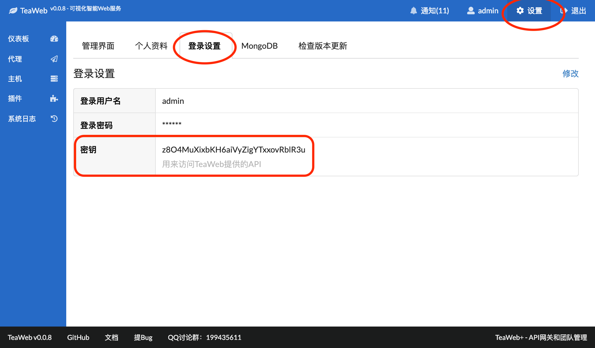

# HTTP API
TeaWeb提供了一组HTTP API，方便用户从TeaWeb获取一些有用的数据，或者对TeaWeb进行操作。

注意：以下内容仅从v0.1.6开始支持。

## API URL
只需要在某个具体的API路径前面加入TeaWeb访问地址即可：
~~~
http://TeaWeb访问地址/API路径
~~~

比如：
~~~
http://192.168.1.100:7777/api/v1/status?TeaKey=W7cy2eFpOKOPgOlaoDgbX11QNPAgIL5E
~~~

其中`TeaKey`是每个API URL都必须带的参数，用于[认证](#认证)。

## 认证
通常我们使用在API的URL中指定`TeaKey`参数来认证API：
~~~
http://TeaWeb访问地址/API路径?TeaKey=登录用户密钥
~~~

其中，在"设置">"登录设置"中可以查看你的登录用户密钥：

如果还没有生成密钥，按照界面的提示点击生成即可。

比如你的TeaWeb访问地址是`192.168.1.100:7777`，一个API路径是`/api/v1/status`，密钥是`123456`，那么调用TeaWeb API的完整地址是：
~~~
http://192.168.1.100:7777/api/v1/status?TeaKey=W7cy2eFpOKOPgOlaoDgbX11QNPAgIL5E
~~~

## 操作失败
如果操作失败，则返回HTTP状态码400：
~~~http
400 Bad Request
Content-Type: application/json; charset=utf-8
...

{
	code: 400,
	data: { },
	errors: null,
	message: "Authenticate Failed 002"
}
~~~

## 易读的JSON格式
如果要想返回更加易读的JSON格式，可以在参数中添加 `TeaPretty` 参数，比如：
~~~
http://192.168.1.100:7777/api/v1/status?TeaKey=W7cy2eFpOKOPgOlaoDgbX11QNPAgIL5E&TeaPretty
~~~

## API列表
以下API列表中的`${xxx}`用来表示一个变量，实际调用的时候需要将变量值代入。

系统提供的API列表如下：
* 系统操作
  * [`GET /api/v1/status`](v1/Status.md) - 读取系统状态，v0.1.6
  * [`GET /api/v1/reload`](v1/Reload.md) - 重载代理状态，v0.1.6
  * [`GET /api/v1/reset`](v1/Reset.md) - 重置锁定状态，v0.1.6
  * [`GET /api/v1/stop`](v1/Stop.md) - 停止服务，v0.1.6
* 代理
  * [`GET /api/v1/proxy/servers`](v1/proxy/Servers.md) - 代理服务列表，v0.1.6
  * [`GET /api/v1/proxy/${serverId}`](v1/proxy/Server.md) - 单个代理服务信息，v0.1.6
  * 访问日志：
     * [`GET /api/v1/proxy/${serverId}/accesslog/latest`](v1/proxy/accesslog/Next.md) - 读取最后一条访问日志，v0.1.8
     * [`GET /api/v1/proxy/${serverId}/accesslog/next/${id}`](v1/proxy/accesslog/Latest.md) - 读取下一条访问日志，v0.1.8
     * [`GET /api/v1/proxy/${serverId}/accesslog/list/${size}`](v1/proxy/accesslog/LatestList.md) - 读取最后N条访问日志，v0.1.8
     * [`GET /api/v1/proxy/${serverId}/accesslog/next/${id}/list/${size}`](v1/proxy/accesslog/NextList.md) - 读取下N条访问日志，v0.1.8
* 监控Agent
  * [`GET /api/v1/agents`](v1/agent/Agents.md) - Agent列表，v0.1.6
  * [`GET /api/v1/agent/${agentId}`](v1/agent/Agent.md) - 查看单个Agent信息，v0.1.6
  * [`GET /api/v1/agent/${agentId}/start`](v1/agent/Start.md) - 启动Agent，v0.1.6
  * [`GET /api/v1/agent/${agentId}/stop`](v1/agent/Stop.md) - 停止Agent，v0.1.6
  * [`GET /api/v1/agent/${agentId}/delete`](v1/agent/Delete.md) - 删除Agent，v0.1.6
* App
  * [`GET /api/v1/agent/${agentId}/apps`](v1/agent/app/Apps.md) - App列表，v0.1.6
  * [`GET /api/v1/agent/${agentId}/app/${appId}`](v1/agent/app/App.md) - 单个App信息，v0.1.6
* 监控项
  * [`GET /api/v1/agent/${agentId}/app/${appId}/item/${itemId}`](v1/agent/app/item/Item.md) - 查看信息，v0.1.6
  * [`GET /api/v1/agent/${agentId}/app/${appId}/item/${itemId}/latest`](v1/agent/app/item/Latest.md) - 查看最新数据，v0.1.6
  * [`GET /api/v1/agent/${agentId}/item/app/${appId}/${itemId}/execute`](v1/agent/app/item/Execute.md) - 执行监控项，v0.1.6
* 任务
  * [`GET /api/v1/agent/${agentId}/app/${appId}/task/${taskId}`](v1/agent/app/task/Task.md) - 查看信息，v0.1.6
  * [`GET /api/v1/agent/${agentId}/app/${appId}/task/${taskId}/run`](v1/agent/app/task/Run.md) - 执行任务，v0.1.6
* 通知
  * [`GET /api/v1/notice/medias`](v1/notice/media/Medias.md) - 媒介列表，v0.1.6
  * [`GET /api/v1/notice/media/${mediaId}`](v1/notice/media/Media.md) - 媒介信息，v0.1.6
  * [`POST /api/v1/notice/media/${mediaId}/send`](v1/notice/media/Send.md) - 发送通知，v0.1.6
* 集群
  * [`GET /api/v1/cluster/node`](v1/cluster/Node.md) - 节点信息，v0.1.6
  * [`GET /api/v1/cluster/push`](v1/cluster/Push.md) - 推送到集群（Master），v0.1.6
  * [`GET /api/v1/cluster/pull`](v1/cluster/Pull.md) - 从集群拉取（Slave），v0.1.6
* 备份
  * [`GET /api/v1/backup/files`](v1/backup/Files.md) - 备份列表，v0.1.6
  * [`GET /api/v1/backup/latest`](v1/backup/Latest.md) - 下载最新备份，v0.1.6
  * [`GET /api/v1/backup/file/:filename`](v1/backup/Download.md) - 下载某个备份文件，v0.1.6
  * [`GET /api/v1/backup/file/:filename/restore`](v1/backup/Restore.md) - 恢复备份，v0.1.6
  * [`GET /api/v1/backup/file/:filename/delete`](v1/backup/Delete.md) - 删除备份，v0.1.6