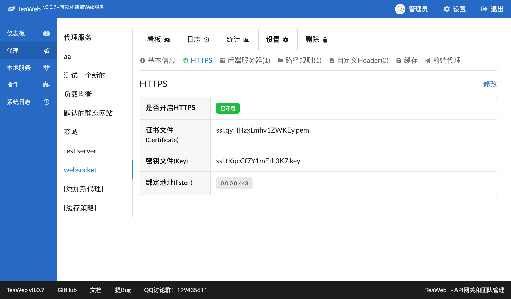
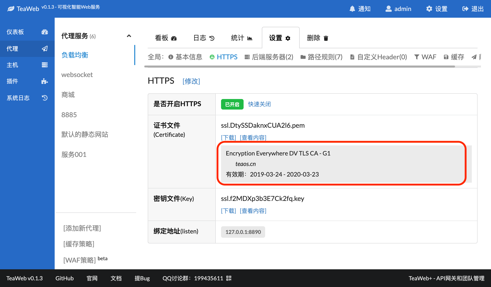

# HTTPS
在你要设置的代理服务的基本信息设置中，点击"HTTPS"选项卡，可以查看和设置HTTPS:

 
HTTPS通常的端口是`443`，建议不要轻易修改。

## 检查HTTPS证书是否正确
从v0.1.2开始，上传完证书后，TeaWeb会自动显示证书信息，以便于我们检查证书是否正确。

可以在代理服务的"HTTPS"菜单对应的页面中看到这些信息：

## HSTS
从v0.1.5开始，可以设置HSTS，来强制浏览器使用安全的连接。可以在"修改" -- "更多选项"中开启。开启后，请求HTTPS时会自动发送一个响应Header：
~~~
Strict-Transport-Security: max-age=31536000; includeSubDomains
~~~
之后，所有使用HTTP协议的请求也会自动转到HTTPS，直到HSTS过了有效期（`max-age`）。

如果你在使用Google Chrome浏览器，可以在浏览器上访问：
~~~
chrome://net-internals/#hsts
~~~
来管理HSTS域名。

## ACME证书
从v0.1.5开始，可以使用TeaWeb提供的工具生成一个免费的DV证书，有效期一般为3个月。可以在某个代理服务中 -- "设置" -- "HTTPS" -- "ACME证书"中申请。

## 常见问题排查
### 浏览器提示证书错误
如果你在浏览器上访问网站的时候，遇到证书错误提示，可以按下面步骤排查：
1. 确认你的代理服务已设置对应的域名，此域名要和浏览器访问的域名一致（也支持二级或多级子域名），**这个至关重要**，因为TeaWeb是根据域名来查找匹配的代理服务的；通常代理服务里的域名要把域名设置完整，比如：`teaos.cn`、`www.teaos.cn`、`api.cloud.teaos.cn`；
2. 在HTTPS页信息中"证书文件"一行信息中正确显示了域名信息，且在有效期内；
3. 确认没有别的代理服务域名设置和当前代理服务域名设置有冲突；
4. 清空浏览器缓存或者在别的电脑上尝试访问此代理服务，以确保浏览器或电脑没有缓存这些证书。

## 自动跳转到HTTPS
从v0.1.2开始，可以设置某个代理服务或者路径规则是否自动跳转到HTTPS上，开启后HTTP的请求会自动跳转到对应的HTTPS请求上：
* 代理服务：在"基本信息" -- "修改" -- "更多选项" -- "自动跳转到HTTPS"中可以设置
* 路径规则：在"路径规则" -- 单个路径规则"详情" -- "修改" -- "更多选项" -- "自动跳转到HTTPS"中可以设置。 