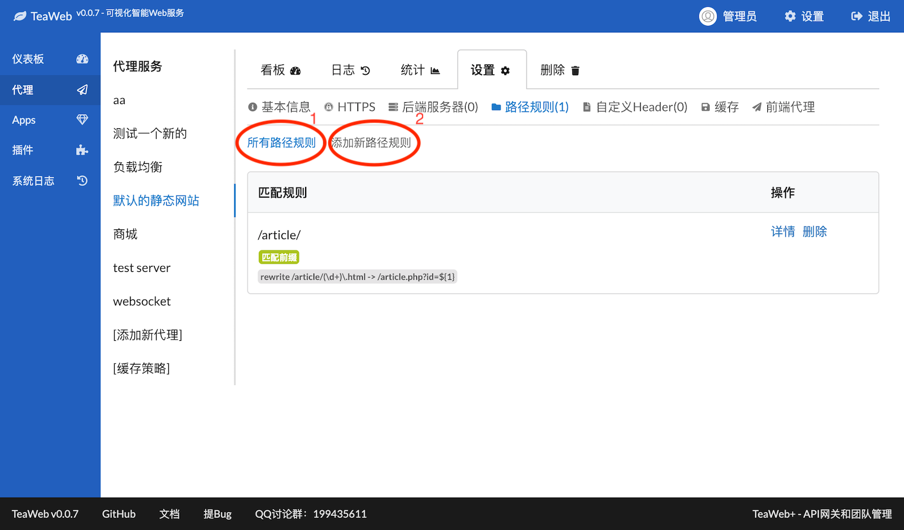

# 路径规则
路径规则（Location）可以定义一组特殊的URL路径匹配模式，匹配这些路径的，可以单独设置文档根目录、字符编码、首页文件、[Fastcgi](Fastcgi.md)、[重写规则](Rewrite.md)、[Websocket](Websocket.md)、[自定义Header](Header.md)等。

比较完整的一个路径规则可设置选项为：
* 基本选项
   * 匹配路径
   * 匹配类型
   * 说明
* 更多选项
   * 文档根目录：设置当前路径规则对应的文档根目录，从而可以让此根目录下的静态资源文件可以被访问；
   * 字符编码：设置当前路径规则对应的字符编码；
   * 首页文件：设置当前路径规则下的首页文件，访问路径未指定文件名时，自动查找这些文件；
   * 访问日志：
      * 是否开启访问日志存储；
      * 要存储的访问日志信息；
   * 统计：可以设置是否开启统计，在追求极致性能的时候可以关闭此选项；
   * Gzip压缩
       * Gzip压缩级别：设置当前路径规则下的文本响应内容是否压缩，级别越高，压缩比例越大
       * Gzip内容最小长度：设置需要压缩的响应内容最小长度
   * 自动跳转到HTTPS：开启后，所有HTTP的请求都会自动跳转到对应的HTTPS URL上，要使用此功能，请先确认你的HTTPS设置正确；
* 特殊匹配设置
   * 不区分大小写：选中表示匹配规则中的路径中的英文字母不区分大小写
   * 反向匹配：选中表示匹配所有不符合规则的路径   

## 路径规则列表
可以在代理服务设置中，查看路径规则列表：

上图中1链接可以查看所有的路径规则列表，2可以添加一个新的路径规则。

## 匹配类型详解
### 匹配前缀
带有此前缀的路径才会被匹配，比如对于路径规则`/hello`，匹配类型"匹配前缀" ，则：
* `/hello` - 匹配成功
* `/hello/world` - 匹配成功
* `/Hello` - 匹配失败，因为没有选择"不区分大小写"
* `/world/hello` - 匹配失败，因为前缀不是`/hello`
   
如果在"特殊匹配设置"中设置了`不区分大小写`，则：
* `/hello` - 匹配成功
* `/hello/world` - 匹配成功
* `/Hello` - 匹配成功，因为设置了"不区分大小写"
* `/HELLO/world` - 匹配成功，因为设置了"不区分大小写"
* `/world/hello` - 匹配失败，因为前缀不是`/hello`

### 精准匹配
带此路径完全一样的路径才会被匹配，比如对于路径规则`/hello`，匹配类型"精准匹配" ，则：
* `/hello` - 匹配成功
* `/hello1` - 匹配失败，因为不完全一样
* `/hello/world` - 匹配失败，因为不完全一样
* `/Hello` - 匹配失败，因为没有选择"不区分大小写"

如果在"特殊匹配设置"中设置了`不区分大小写`，则：
* `/hello` - 匹配成功
* `/hello1` - 匹配失败，因为不完全一样
* `/hello/world` - 匹配失败，因为不完全一样
* `/Hello` - 匹配成功，因为设置了"不区分大小写"
* `/HELLO` - 匹配成功，因为设置了"不区分大小写" 

### 正则表达式匹配
通过正则表达式来匹配路径，可以在[查看正则表达式语法](../regexp/Regexp.md)。

示例1：比如对于路径规则`/hello`，匹配类型"正则表达式匹配"，则：
* `/hello` - 匹配成功
* `/hello1` - 匹配成功
* `/hello/world` - 匹配成功
* `/world/hello` - 匹配成功
* `/Hello` - 匹配失败，因为没有选择"不区分大小写"

示例2：比如对于路径规则`(?i)/hello`，匹配类型"正则表达式匹配" ，则：
* `/hello` - 匹配成功
* `/hello1` - 匹配成功
* `/hello/world` - 匹配成功
* `/Hello` - 匹配成功，因为`(?i)`表示不区分大小写
* `/HELLO` - 匹配成功，因为`(?i)`表示不区分大小写

示例3：比如对于路径规则`(?i)^/hello$`，匹配类型"正则表达式匹配" ，则：
* `/hello` - 匹配成功
* `/hello1` - 匹配失败，因为规则中的`$`表示结束
* `/hello/world` - 匹配失败，因为规则中的`$`表示结束
* `/world/hello` - 匹配失败，因为规则中的`^`表示开始
* `/Hello` - 匹配成功，因为`(?i)`表示不区分大小写

## 命名变量
如果匹配类型"正则表达式匹配"，可以在正则表达式中设置一个变量，以供在文档根目录、重写规则、后端服务器等很多地方使用。

我们想在访问`/hello/子目录`时都跳转到`/hello`，就可以添加一个规则：
~~~
^/hello/(?P<name>.+)$
~~~
其中`(?P<name>)`表示命名变量`${name}`，你当然可以改成别的变量名；然后在重写规则中加入一个规则：
* 匹配规则：`.*`
* 目标URL：`/${name}`

保存后按照提示重启服务即可，试着访问以下路径：
~~~
/hello/zhangsan 跳转到 /zhangsan
/hello/lisi 跳转到 /lisi
~~~

## 匹配条件
可以在路径规则中设置更多的匹配条件，以便于实现更强大的匹配规则，更多的匹配条件可以看[匹配条件](RequestCond.md)一节。在"路径规则" -- "修改" -- "更多选项"中可以添加匹配条件。

可以在匹配条件中使用的变量在[这里](http://teaos.cn/doc/proxy/Variables.md#%E8%AF%B7%E6%B1%82%E7%9B%B8%E5%85%B3%E5%8F%98%E9%87%8F)查看。

### 示例1：根据URL参数决定是否匹配
比如对于同样的一个URL，但参数中的ID有以下条件：`id<1000`时匹配这个路径规则，`id>=1000`时则不匹配，则需要增加一个匹配条件：
* 路径规则：`/hello` 
* 匹配类型：精准匹配
* 匹配条件
  * 参数：`${arg.id}`
  * 运算符：`小于`
  * 对比值：`1000`

这样对于`/hello?id=588`是匹配的，对于`/hello?id=1024`是不匹配的。

这个示例可以用于对用户进行分流处理。

### 示例2：根据URL参数决定不同的后端服务器
可以设置两个同样的路径规则，添加不同的后端服务器，只是匹配条件不同：

路径规则1：
* 路径规则：`/hello` 
* 匹配类型：精准匹配
* 匹配条件
  * 参数：`${arg.id}`
  * 运算符：`小于`
  * 对比值：`1000`
  
路径规则2：  
* 路径规则：`/hello` 
* 匹配类型：精准匹配
* 匹配条件
  * 参数：`${arg.id}`
  * 运算符：`大于等于`
  * 对比值：`1000`
  
这样对于`/hello?id=588`访问的是路径规则1配置的后端服务器，`/hello?id=1024`访问的是路径规则2配置的后端服务器。  
    