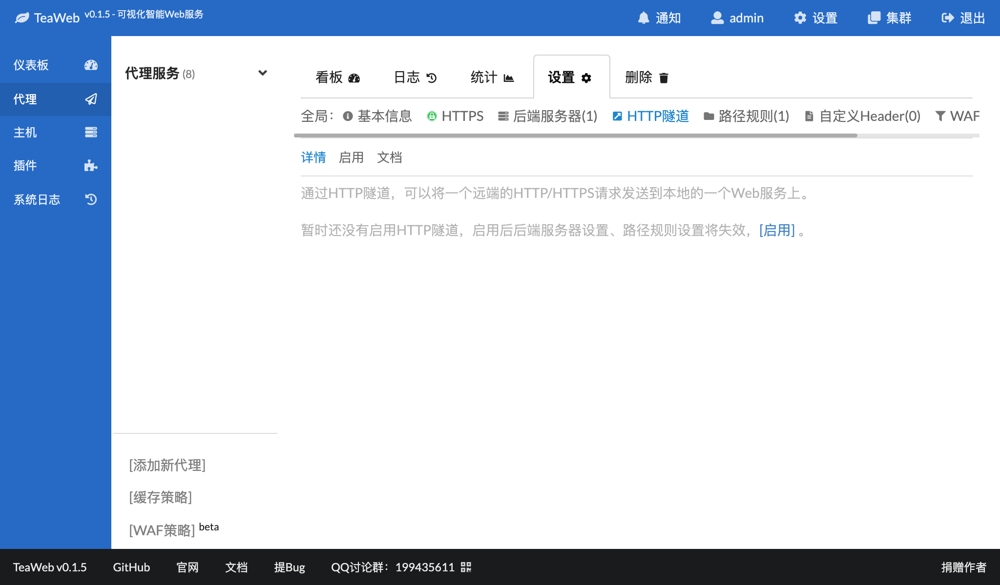
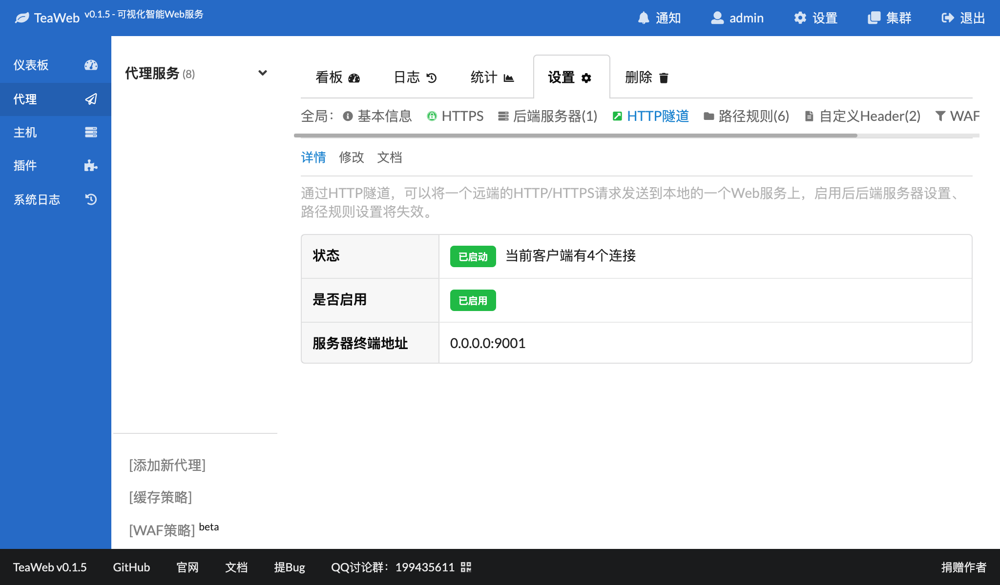

# HTTP隧道
从v0.1.5开始，TeaWeb提供一个HTTP隧道的功能，使用于将局域网内的Web服务暴露给公网。

## 原理
~~~
1.Public User  <-->  | 2.TeaWeb Proxy |  <-->  | 3.HTTP Tunnel Server | <--> | 4.HTTP Tunnel Client |  <--> | 5.Local Web|											 
~~~
整个流程说明如下：
1. 公网用户访问TeaWeb代理服务
2. TeaWeb代理服务将用户请求转发到HTTP隧道服务器端
3. HTTP隧道服务器端再将请求转发到HTTP隧道客户端
4. HTTP隧道客户端负责将需求转发到本地的Web服务
5. 待本地的Web服务有响应的时候，HTTP隧道再往上返回响应数据，最终发送给公网用户

## 使用HTTP隧道
要使用HTTP隧道需要四个步骤：
1. 配置代理服务
2. 在代理服务中启用HTTP隧道
3. 部署HTTP隧道客户端
4. 测试代理服务

### 配置代理服务
在TeaWeb中添加一个代理服务，此代理服务用户接收用户的访问，此代理服务通常可以通过公网来访问。

如果你以前没有添加过代理服务，可以参考[添加代理](./CreateProxy.md)文档。

### 在代理服务中启用HTTP隧道
在已添加的代理服务中"HTTP隧道"菜单中可以启用HTTP隧道：

点击"启用"：

其中：
* `服务器终端地址`：HTTP隧道服务器端地址，此地址中的IP和TeaWeb一致，因为是TeaWeb来启动的。需要设置防火墙确保此地址能被客户端所能连接。客户端会连接此终端地址，将本地的HTTP请求结果发送回代理服务；
* `是否启用`：是否启用此HTTP隧道。

填好后，保存并按照提示重启即可。如果出现错误，会在界面上显示。

注意：在启用HTTP隧道后，所有的后端服务器将失效，因为此时所有的请求都会转发到HTTP隧道中。

### 部署HTTP隧道客户端
从 [http://teaos.cn/download#tunnel](http://teaos.cn/download#tunnel) 下载对应系统的HTTP隧道客户端，并解压。

解压后的目录为：
~~~
bin/       # 命令相关文件
configs/   # 配置相关文件
logs/      # 日志相关文件
start.bat  # Windows系统专有
~~~

#### 配置HTTP隧道客户端
用编辑器打开`configs/config.yml`：
~~~yaml
tunnels:
  - remote: "8.8.8.8:9001"
    local: "http://127.0.0.1"
    host: ""
~~~
修改其中的：
* `remote` - 客户端可以访问到的HTTP终端地址，通常是IP+端口
* `local` - 本地Web服务的访问地址
* `host` - 本地Web服务的域名，如果为空，表示使用用户实际访问的域名

#### 启动HTTP隧道客户端
在配置好客户端后，如果是在Windows上，可以双击`start.bat`直接运行，在别的系统可以使用：
~~~bash
bin/teaweb-tunnel start
~~~
启动，如果想查看更多可以使用的命令可以通过：
~~~bash
bin/teaweb-tunnel -h
~~~
来查看。

如果`teaweb-tunnel`在后台运行时，会在`logs/run.log`中存储运行日志，以便于我们调试问题。

### 测试代理服务
在配置并启动HTTP隧道客户端后，可以在HTTP隧道页查看当前状态：

如果HTTP隧道客户端连接服务器端成功，会显示"当前客户端有x个连接"，如果是0个连接，请检查客户端连接错误。